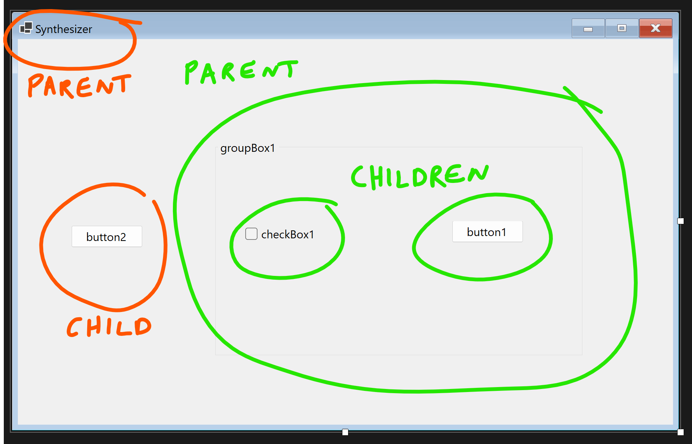

# README

## Overview

This project exists to help me improve my C#/.NET skills for work. I chose to write a synthesizer because I love producing synth-based music and was also curious to learn about audio programming (having been an Audio Engineer prior to career-switching to software engineering).

There are comments *everywhere* explaining EVERYTHING (don't be alarmed) and this README mostly consists of additional notes about how the .NET framework and C# language work. The project is more of a documentation exercise and sandbox playground for myself; potentially not the most useful repo if you are a seasoned veteran 🫡

Please leave comments (or even open a pull request) if you have ideas for improvement or would like to share your twopence with me 👂

## Functionality

### GroupBox

Find GroupBox here: **View > Toolbox > All Windows Forms > GroupBox**

GroupBox is a **parent** control (meaning everything inside it will be controlled). Anything outside of the GroupBox will have the WindowsForm as the parent. This is illustrated below:



---

### EventHandler delegate

The event model in the .NET Framework is based on having an event delegate - this connects an event with its handler.
To raise an event, two elements are needed:

- A delegate that identifies the method that provides the response to the event. For example:

```csharp
    private void WaveButton_Click(object sender, EventArgs e)
    {
    }
```

- A class that holds the event data (*if* the event provides data). For example:

```csharp
public class Oscillator : GroupBox
    {
    }
```
